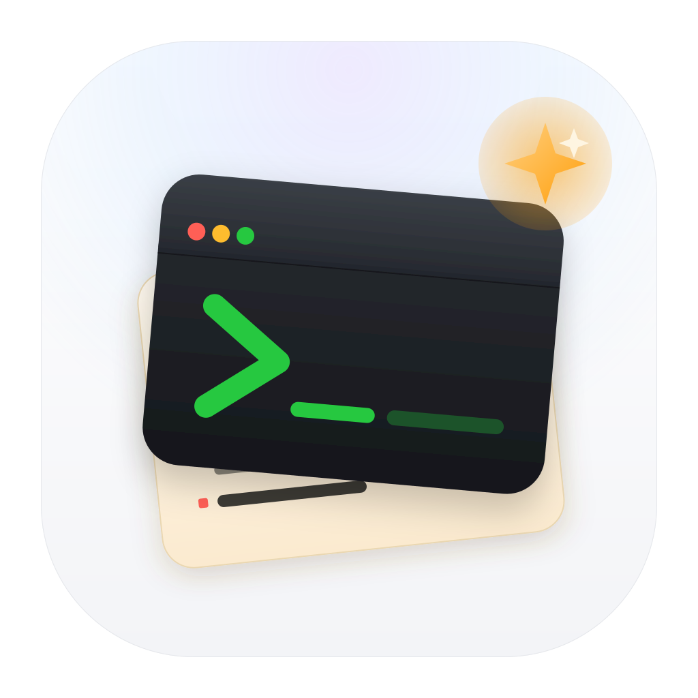
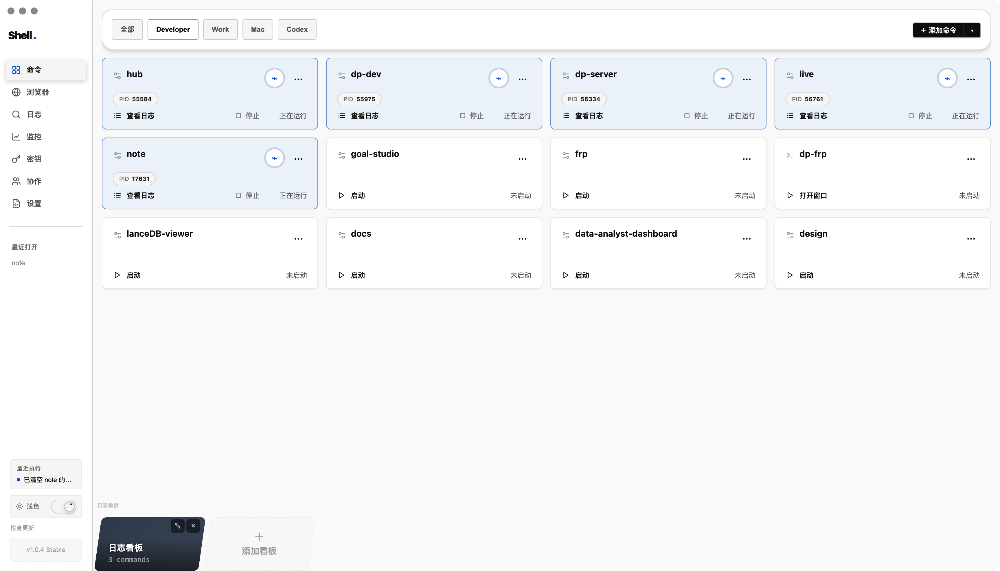

  

<h1 align="center">ShellManage</h1>

不用记命令，也不用重复输入。

  保存项目启动命令、SSH 隧道和其他重复操作，需要时直接运行，并在同一处查看状态和日志。

  <a href="https://github.com/liuzhuang/shell-manage/releases">下载公开版本</a>
  ·
  <a href="DEVELOPMENT.md">开发与部署</a>
  ·
  <a href="skills/shell-manage-assistant/INSTALL.md">安装 Assistant Skill</a>

## 把每天要开的项目放在同一页

ShellManage 是基于 Electron、React 和 TypeScript 的桌面应用，使用本地 YAML 配置管理可重复执行的开发操作。

- 保存并启动项目命令，统一查看运行状态和实时日志。
- 在独立会话中打开本地服务与常用网页。
- 查看本机或远程服务器的 CPU、内存、磁盘和网络状态。
- 管理 SSH 私钥映射、项目目录和可分享脚本。
- 接入 AI 模型服务，分析日志并生成需要确认的查询命令。

## 三步上手

1. 从 [GitHub Releases](https://github.com/liuzhuang/shell-manage/releases) 下载与系统和芯片架构匹配的安装包。
2. 安装并启动 ShellManage，等待应用创建 `~/.shell-manage/config.yaml`。
3. 按照 [Assistant Skill 安装说明](skills/shell-manage-assistant/INSTALL.md) 导入当前项目的启动命令。

## 主要功能

| 功能 | 说明 |
|---|---|
| 命令 | 添加、导入、启动、停止和重启后台服务或交互终端 |
| 浏览器 | 使用独立会话打开本地服务与常用网页，保留标签页状态 |
| 日志 | 查看实时输出，并使用 AI 辅助分析日志 |
| 监控 | 查看本机或远程服务器的资源状态 |
| 密钥 | 管理保存在本机的 SSH 私钥映射 |
| 协作 | 管理项目目录与脚本，通过 YAML 片段分享配置 |
| 设置 | 在可视化编辑与 YAML 源码编辑之间切换 |

## 下载

公开版本通过 [GitHub Releases](https://github.com/liuzhuang/shell-manage/releases) 提供：

- Windows x64：NSIS 安装程序（`.exe`）
- macOS Intel：DMG 安装包（`x64.dmg`）
- macOS Apple Silicon：DMG 安装包（`arm64.dmg`）

当前产物是未签名预览版，不需要 Apple Developer 或 Windows 代码签名账号。macOS 需要从 GitHub Releases 手动下载更新；Windows 保留自动检查更新，但安装时可能显示「未知发布者」或 SmartScreen 提示。

## 数据与安全

- 默认配置保存在 `~/.shell-manage/config.yaml`。
- SSH 私钥内容保存在本机密钥目录；配置文件只记录 ID、名称和时间等元数据。
- 查询命令在执行前经过风险判断，需要确认的操作不会直接运行。

开发环境、构建产物、自动发版和官网部署见 [开发与部署](DEVELOPMENT.md)。
